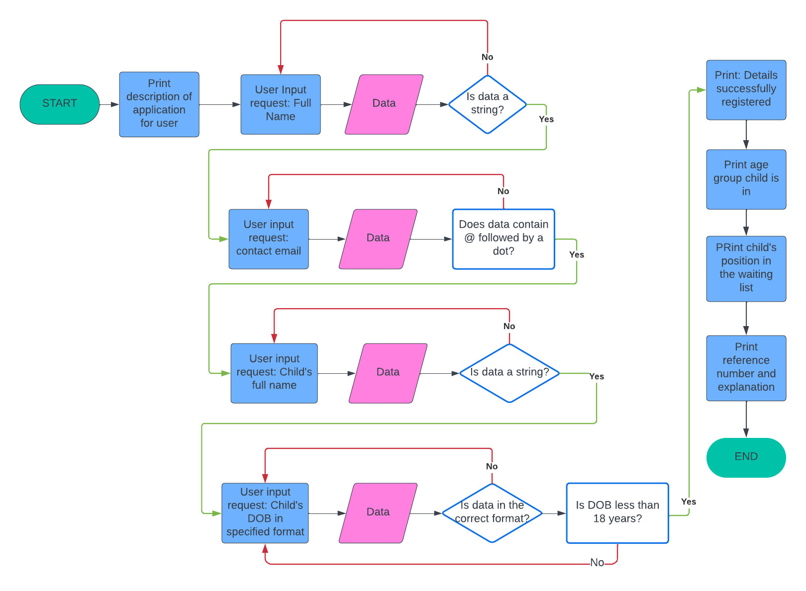

# Scout Group Waiting List

## Contents
- [User Experience](#user-experience)
    - [Initial Discussion](#initial-discussion)
    - [User Stories](#user-stories)
- [Design](#design)
    - [Lucidchart Flowchart](#lucidchart-flowchart)
- [Features](#features)
- [Dependencies](#dependencies)
- [Bugs](#bugs)
    - [Known Bugs](#known-bugs)
    - [Solved Bugs](#solved-bugs)

## User Experience
### Initial Discussion
This application is designed to be run in a terminal environment. Its purpose is to take in user information and add it to a database for a club membership waiting list. The application can also be used to check if their position on the waiting list has changed.

### User Stories
#### First-time Visitor Goals
- To understand the purpose of the program.
- To enter data without error or confusion.

#### Returning Visitor Goals
- To edit incorrect data in their entry
- To check their data and position in list

#### Frequent Visitor Goals
- To edit and amend entries on the list

## Design
### Lucidchart Flowchart

## Features
- Take in user details: name, phone number, child's name, date of birth
- confirm user data
- return waitiing list reference number
- return which age section the child will be joining
- allow user to check their position using the ref number
- allow admin to view waiting list and delete rows

## Dependencies
[Colorama](https://pypi.org/project/colorama/)

## Bugs
### Known Bugs

### Solved Bugs
| # | Bug | Image | Solution |
| --- | --- | --- | --- |
| 1 | Validating user choice crashed the code passing a letter into int(). | | Set choice check to '1' '2' '3' to avoid this. |
| 2 | dob had time at the end in 0s. || Adding .date() to the end removed them. |
| 3 | When refactoring `get_details()` the error message printed once for each spreadsheet searched instead of just printing once and requesting new user input. |  | The else was changed to an if statement and indented back to the level of the while loop. |

## To-do List
- Update validate_name function to only allow one space and/or one hypen between letters
- add try except to all instances of accessing google sheet.
- hash the admin password