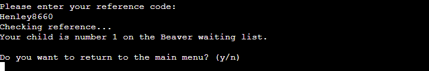
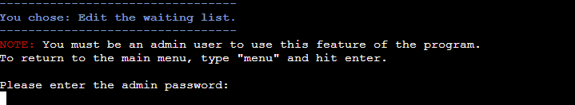

# Scout Group Waiting List

Deployed program on Heroku: [Scout Group Waiting List](https://scouts-waiting-list-7d813d9f1b2e.herokuapp.com/)

## Contents
- [User Experience](#user-experience)
    - [Initial Discussion](#initial-discussion)
    - [User Stories](#user-stories)
- [Design](#design)
    - [Lucidchart Flowchart](#lucidchart-flowchart)
    - [Colours](#colours)
- [Features](#features)
- [Dependencies](#dependencies)
- [Bugs](#bugs)
    - [Known Bugs](#known-bugs)
    - [Solved Bugs](#solved-bugs)

## User Experience
### Initial Discussion
This application is designed to be run in a terminal environment. Its purpose is to take in user information and add it to a database for a club membership waiting list. Users may also use the application to check their child's position on the waiting list. Admin users are able to view the content of the waiting list and delete entries where appropriate.

### User Stories
#### First-time Visitor Goals
- To understand the purpose of the program.
- To enter data without error or confusion.
- To ensure data is correct before submission.

#### Returning Visitor Goals
- To check their child's position in the waiting list.

#### Frequent Visitor Goals
- To view and delete entries on the list.

## Design
### Lucidchart Flowchart
An inital concept was developed in a flowchart to give a good sense of the flow of the program and how the users would interact with inputs.

### Colours
The Colorama module was utilised to introduce some colour to the program. Headings were given a blue foreground colour reflective of the Scout uniform in Ireland. Error warning messages were given a red colour to bring attention to the user that something has gone wrong. 

In admin mode, each age section has an associated foreground colour related to the section badge: red for Beavers; green for Cubs; blue for Scouts, since there is no orange option and yellow was not pleasing to the eye; and magenta for Ventures, being the closest available colour to purple. The colours are also used for the headings when each waiting list is displayed for the admin user.

## Features
This program is written completely in Python. The inital scope of the project was set out to achieve the following:
- Take in user details: name, phone number, contact email, child's name, and child's date of birth
- Confirm the user data
- Return a waitiing list reference number
- Return which age section the child will be joining
- Allow user to check their position using the reference number
- Allow an admin to view the waiting lists and delete rows

All of these goals were achieved in this version of the program.

The user is greeted on running the program by a descriptive header welcoming them to the waiting list of the 101st Dublin Scout Group. This is a fictional group (currently not on the list of active scout groups).

Clear instructions are given to the user explaining what to do next to use the program. Only four inputs are accepted: The numbers `1`, `2`, `3`, or `4`.

### Option 1
If the user enters `1`, feedback is given via a descriptive heading to confirm that the program is ready to add their child to the waiting list.

The user is then prompted to enter their first name, last name, contact email, child's first name, child's last name, and child's date of birth. The details are printed to the terminal and the user is asked to confirm them. If they enter `n`, the previous prompts repeat.

If the user enters `y`, the data is sent to the Google Sheets spreadsheet and a confirmation message is shown if successful. This message confirms which age section the child will join and the reference number that the user needs to use to check their position in the list.

The user is given the option to return to the main menu by inputting `y` or exit the program with `n`.

### Option 2
If the user selects option `2`, another descriptive heading is shown.

When the user enters a reference code, a message is printed to inform them that it is being verified. If valid, their child's position in the waiting list is printed to the terminal along with the name of the age section.

The user is again given the option to return to the main menu by inputting `y` or exit the program with `n`.

### Option 3
If an admin user wants to view and edit the waiting list, they can enter `3`. A password request is presented to prevent unauthorized access to the data.

Upon successful login, the admin user is presented with a list of the waiting lists to choose from. Entering a number from `1` to `4` prints the respective waiting list to the terminal in the form of lists of the data entries.

The chosen waiting list is printed under a descriptive heading.

At this point the admin user is given the option to delete someone from the waiting list for any reason e.g. the child has been enrolled or changed their mind about joining.

Entering `y` will present a new input asking the user to select a number from the list corresponding to the data row they wish to delete. When a number is chosen, the input choice is shown on screen as well as details of the data row being deleted. 
Messages then print to say an attempt is being made to delete the row and if the row was successfully deleted.

An option to delete another entry is presented to the user. If `y` is entered, the updated waiting list in printed to the terminal again and the same steps above are follows. If `n` is entered, the user is asked if they want to view the waiting lists again and the same processes follow as above.

Finally, the user is given the option to return to the main menu by inputting `y` or exit the program with `n`.

### Option 4
To exit the program, the user can `4`. Before full shutdown, a message prints to let them know the program is closing.

## Validation
All user inputs and gspread processes are validated by the program. Each validation check is explained below and fully comprehensive testing of the validation is detailed in the [Manual Testing section](#manual-testing).

### Validating the Main Menu
In the main menu, the user is asked to choose from four options by entering `1`, `2`, `3`, or `4`. The `get_user_choice()` function checks if the user inputs exactly match either of these four numbers as a string; if not, it prints an error message and remind the users they must choose only one of the four numbers specified.

### Validating Names
The user inputs for the parent's first name, parent's last name, child's first name, and child's last name are subjected to a name validation check.

The `validate_name()` function takes in two strings as parameters: the message to be printed, and a description of the name being validated. The function asks for input and removes any leading and trailing whitespaces with `.strip()`. The string is then searched for any numbers and a ValueError is raised if they are found. 

If the string contains at least two characters, the input is saved with the first letter capitalised using `.title()`, otherwise a Value Error is raised.

### Validating Emails
The `validate_email()` function uses RegEx to check if the user input matches the specified email format:

- Name made up of any word or hypen or full stop: `[\w\.-]` e.g. `john.smith`
- The `@` symbol
- A domain name made up of any word including hyphens: `[\w-]` e.g. `foresty-group`
- A full stop `.`
- The rest of the domain made up of any words and full stops: `[\w\.]` e.g. `.co.uk`

Put together, the RegEx pattern for this is 
`^[\w\.-]+@[\w-]+\.+[\w\.]+$`

If the user enters an invalid input, the below error is shown which reminds the user of the correct email format required.

Valid inputs are returned by the funtion.

### Validating Dates of Birth
The `validate_dob()` fuction asks the user to input their child's date of birth in the format `DD/MM/YYYY`. If an invalid format is entered the user is prompted again to enter the date in the specified format. (See [Try Except Clauses](#try-except-clauses))

If a future date is entered, the user is warned that dates of birth must be in the past.

If a date of birth is entered for an adult, the user is informed that only children younger than 18 can be added to the waiting list.

### Validating Yes/No Inputs
The `validate_yes_no()` function returns `True` or `False` based on the user's input of `y` or `n` respectively. The user input is made lowercase using `lower()` and checked for an exact match to either `y` or `n`. If the input is invalid, an error message is printed reminding the user that they must only enter `y` or `n` and the prompt is repeated.

### Try Except Clauses
A number of function use try and except clauses to catch any unintended errors and inform the user that something has gone wrong.

The first instance of these are found in the `validate_name()` function where strings are checked for invalid characters and if any are found, or the pass conditions are not met, a ValueError is raised. The clauses are used here due to the large number of possible characters that could be used in names from around the world, something that would be laborious and excessive to code out explicitly in if-else statements.

In the `validate_dob()` function, the date string provided by the user is converted to a date using `strptime()` and the format `"%d/%m/%Y"`. If there is an error converting the string, a ValueError is raised by the except clause. Again, any possible number of inputs could be entered by the user here, so a try-except clause works well.

In the `push_details()`, `get_details()`, `get_worksheet()` and `delete_row()` functions, the Google Sheets spreadsheet is either called or manipulated somehow. In order to avoid the program crashing in case there is some unforseen issue accessing the spreadsheet, all the relevant methods are placed inside a try clause in these functions and the except clause prints a message telling the user that there has been an unexpected issue accessing the waiting list and to please try again later.

## Technologies Used
### Languages
Python

### Frameworks, Libaries, and Programs
[Lucidchart](https://lucid.app/) - To create flowcharts.

Visual Studio Code - An IDE used to write my code.

[Gitpod](https://www.gitpod.io/) - A cloud IDE also used to write my code.

[Git](https://git-scm.com/) - For version control.

[GitHub](https://github.com/) - To save and store files online.

[W3Schools.com](https://www.w3schools.com/) and [The Python Library](https://docs.python.org/3/library/) - For researching and learning about Python methods and syntax.

[ScreenToGif](https://www.screentogif.com/) - To create gif files for this README.

Adobe Photoshop 2020 - To pixellate and crop some README images.

[Heroku](https://www.heroku.com/) - To host the deployed version of the program.

[Sheilds.io](https://shields.io/) - To add badges to this README.

[CI Python Linter](https://pep8ci.herokuapp.com/#) - To ensure code meets minimum PEP8 standards.

### Dependencies
- [Colorama](https://pypi.org/project/colorama/) - To apply some colour to text in the program.
- [Gspread](https://docs.gspread.org/) - API allowing manipulation of data with a Google Sheet spreadhsheet.
- [Google Auth](https://google-auth.readthedocs.io/) - API to control access to the spreadsheet.
- [Datetime](https://github.com/python/cpython/tree/3.12/Lib/datetime.py) - To work with strings and integers as dates in the code.
- [Random](https://github.com/python/cpython/tree/3.12/Lib/random.py) - To generate random numbers.
- [Re](https://github.com/python/cpython/tree/3.12/Lib/re/) - To work with regular expression operations.

## Bugs
### Known Bugs

### Solved Bugs
| # | Bug | Image | Solution |
| --- | --- | --- | --- |
| 1 | Validating user choice crashed the code passing a letter into int(). | | Set choice check to '1' '2' '3' to avoid this. |
| 2 | dob had time at the end in 0s. || Adding .date() to the end removed them. |
| 3 | When refactoring `get_details()` the error message printed once for each spreadsheet searched instead of just printing once and requesting new user input. |  | The else was changed to an if statement and indented back to the level of the while loop. |
| 4 | When entering an email with more than one `.` in the domain name, the input was rejected. |  | |
| 5 | After deleting a row from the waiting list, the code as it was did not update the numbers associated with the remaining entries and the user could delete the wrong entry or try to keep deleting the last entry which would be a blank row. | | The functions associated with this task were reordered and improved. New while loops now manage the printing of the updated waiting lists before the user is asked if they want to delete another entry.|
| 6 | A correct number input by the user was marked as invalid if a whitespace was accidentally included after the number. |  | The `.strip()` method was applied to the user input to remove leading and trailing whitespaces. |
| 7 | With the `validate_name()` function it was possible to enter a very long invalid input which resulted in the lines in the error message string being longer than 80 characters and this sometimes caused words to be split over two lines as the terminal wrapped to a new line. |  | The error message was separated into two strings and when the user input was detected as containing more than 49 characters, intead of being printed to the terminal, the string `That is not a valid {parameter}.` was inserted with the appropriate parameter name at the end of the string. This prevented any error messages being longer than 80 characters per line. Similar code was added to the `validate_email()` function to achieve the same result.| 

## Credits
The images of the badges in this README were taken from the Scout Shop [website](https://thescoutshop.ie/collections/badges).

## To-do List
- Update validate_name function to only allow one space and/or one hypen between letters
- hash the admin password
- allow user to return to main menu from any input line
- add code to show a maximum number of rows at a time if the waiting list is very long?
