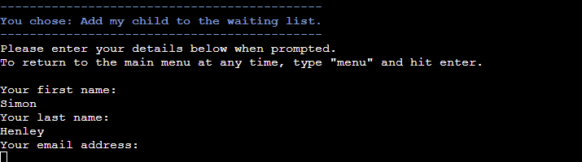
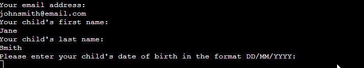

# Scout Group Waiting List

Deployed program on Heroku: [Scout Group Waiting List](https://scouts-waiting-list-7d813d9f1b2e.herokuapp.com/)

## Contents
- [User Experience](#user-experience)
    - [Initial Discussion](#initial-discussion)
    - [User Stories](#user-stories)
- [Design](#design)
    - [Lucidchart Flowchart](#lucidchart-flowchart)
    - [Colours](#colours)
- [Features](#features)
    - [Menu Option 1](#menu-option-1)
    - [Menu Option 2](#menu-option-2)
    - [Menu Option 3](#menu-option-3)
    - [Menu Option 4](#menu-option-4)
    - [Features to be Implemented](#features-to-be-implemented)
- [Validation](#validation)
    - [Validating the Main Menu](#validating-the-main-menu)
    - [Validating Names](#validating-names)
    - [Validating Emails](#validating-emails)
    - [Validating Dates of Birth](#validating-dates-of-birth)
    - [Validating Yes/No Inputs](#validating-yesno-inputs)
    - [Validating Admin Status](#validating-admin-status)
    - [Try-Except Clauses](#try-except-clauses)
- [Technologies Used](#technologies-used)
    - [Languages](#languages)
    - [Frameworks, Libraries, and Programs](#frameworks-libraries-and-programs)
    - [Dependencies](#dependencies)
- [Deployment](#deployment)
    - [Local Deployment](#local-deployment)
- [Testing](#testing)
    - [Manual Testing](#manual-testing)
    - [Full Testing](#full-testing)
    - [Automated Testing](#automated-testing)
- [Bugs](#bugs)
    - [Known Bugs](#known-bugs)
    - [Solved Bugs](#solved-bugs)
- [Credits](#credits)
    - [Media](#media)
    - [Code Used](#code-used)
- [Acknowledgements](#acknowledgements)

## User Experience
### Initial Discussion
This application is designed to be run in a terminal environment. Its purpose is to take in user information and add it to a database for a club membership waiting list. Users may also use the application to check their child's position on the waiting list. Admin users can view the content of the waiting list and delete entries where appropriate.

### User Stories
#### First-time Visitor Goals
- To understand the purpose of the program.
- To enter data without error or confusion.
- To ensure data is correct before submission.

#### Returning Visitor Goals
- To check their child's position on a waiting list.

#### Frequent Visitor Goals
- To view and delete entries on a waiting list.

## Design
### Lucidchart Flowchart
An initial concept was developed in a flowchart to give a good sense of the flow of the program and how the users would interact with inputs.

### Colours
The Colorama module was utilised to introduce some colour to the program. Headings were given a blue foreground colour reflective of the Scout uniform in Ireland. Error warning messages were given a red colour to bring attention to the user that something has gone wrong. 

In admin mode, each age section has an associated foreground colour related to the section badge: red for Beavers; green for Cubs; blue for Scouts, since there is no orange option and yellow was not pleasing to the eye; and magenta for Ventures, being the closest available colour to purple. The colours are also used for the headings when each waiting list is displayed for the admin user.

## Features
This program is written completely in Python. The initial scope of the project was set out to achieve the following:
- Take in user details: name, phone number, contact email, child's name, and child's date of birth
- Confirm the user data
- Return a waiting list reference number
- Return which age section the child will be joining
- Allow user to check their position using the reference number
- Allow an admin to view the waiting lists and delete rows

All of these goals were achieved in this version of the program.

The user is greeted on running the program by a descriptive header welcoming them to the waiting list of the 101st Dublin Scout Group. This is a fictional group (currently not on the list of active scout groups).

Clear instructions are given to the user explaining what to do next to use the program. Only four inputs are accepted: The numbers `1`, `2`, `3`, or `4`.

### Menu Option 1
If the user enters `1`, feedback is given via a descriptive heading to confirm that the program is ready to add their child to the waiting list.

The user is then prompted to enter their first name, last name, contact email, child's first name, child's last name, and child's date of birth. The details are printed to the terminal and the user is asked to confirm them. If they enter `n`, the previous prompts repeat.

If the user enters `y`, the data is sent to the Google Sheets spreadsheet and a confirmation message is shown if successful. This message confirms which age section the child will join and the reference number that the user needs to use to check their position in the list.

The user is given the option to return to the main menu by inputting `y` or exit the program with `n`.

#### Cancel Registration of Details
Should the user wish to abort the process of entering details or if they get stuck in a loop entering invalid inputs over and over, they may type `menu` into the terminal and the `register_details()` function will end. In this case, the `push_details()` will not be called and the user will be given the option to return to the main menu by inputting `y` or exit the program with `n`.

Gif of user exiting the details registration process early

### Menu Option 2
If the user selects option `2`, another descriptive heading is shown.

When the user enters a reference code, a message is printed to inform them that it is being verified. If valid, their child's position on the waiting list is printed to the terminal along with the name of the age section.

The user is again given the option to return to the main menu by inputting `y` or exit the program with `n`.

If the user enters an invalid code three times, they are given the option to exit the process or continue attempting to enter a code. This check repeats for every three invalid attempts.

### Menu Option 3
If an admin user wants to view and edit the waiting list, they can enter `3`. A password request is presented to prevent unauthorized access to the data. If the user enters an invalid password three times, they are given the option to exit the process or continue attempting to enter a password. This check repeats for every three invalid attempts.

Upon successful login, the admin user is presented with a list of the waiting lists to choose from. Entering a number from `1` to `4` prints the respective waiting list to the terminal in the form of lists of the data entries.

The chosen waiting list is printed under a descriptive heading.

At this point, the admin user is given the option to delete someone from the waiting list for any reason e.g. the child has been enrolled or changed their mind about joining.

Entering `y` will present a new input asking the user to select a number from the list corresponding to the data row they wish to delete. When a number is chosen, the corresponding name of the child to be removed from the waiting list is shown. The user is then asked to confirm the action of deletion. Entering `n` will cancel this process and ask the user if they want to edit another section. Entering `y` will print a message saying an attempt is being made to delete the row and then another message either stating that the row was successfully deleted or that something went wrong accessing the data.

An option to delete another entry is presented to the user. If `y` is entered, the updated waiting list is printed to the terminal again and the same steps above are followed. If `n` is entered, the user is asked if they want to view the waiting lists again and the same processes follow as above.

Finally, the user is given the option to return to the main menu by inputting `y` or exit the program with `n`.

#### Large Waiting Lists
A later addition to this program tackled the idea of printing a long waiting list to the terminal. I decided to initially limit the display of large lists to the first 15 data entries only, as this looked neat in the confines of the 24-row high Heroku terminal. The user can choose to then print the rest of the rows if they wish. In each instance, they are then given the option to select a row to delete.

Gif of a large waiting list being viewed

### Menu Option 4
To exit the program, the user can `4`. Before full shutdown, a message prints to let them know the program is closing.

### Features to be Implemented
- Restrict the input of `validate_name()` further to disallow symbols that are not generally used in names anywhere in the world e.g. `?` and `&`.

## Validation
All user inputs and GSpread processes are validated by the program. Each validation check is explained below and fully comprehensive testing of the validation is detailed in the [Manual Testing section](#manual-testing).

### Validating the Main Menu
In the main menu, the user is asked to choose from four options by entering `1`, `2`, `3`, or `4`. The `get_user_choice()` function checks if the user inputs exactly match either of these four numbers as a string; if not, it prints an error message and reminds the user that they must choose only one of the four numbers specified.

### Validating Names
The user inputs for the parent's first name, parent's last name, child's first name, and child's last name are subjected to a name validation check.

The `validate_name()` function takes in two strings as parameters: the message to be printed, and a description of the name being validated. The function asks for input and removes any leading and trailing whitespaces with `.strip()`. The string is then searched for any numbers and a ValueError is raised if they are found. 

If the string contains any of the symbols below, a ValueError is raised:
- `¬¦!"£$%^&*()_+={}[]:;@~#<>,.?\/` `

If the string contains at least two characters, the input is saved with the first letter capitalised using `.title()`, otherwise a Value Error is raised.

### Validating Emails
The `validate_email()` function uses RegEx to check if the user input matches the specified email format:

- Name made up of any word or hyphen or full stop: `[\w\.-]` e.g. `john.smith`
- The `@` symbol
- A domain name made up of any word including hyphens: `[\w-]` e.g. `foresty-group`
- A full stop `.`
- The rest of the domain made up of any words and full stops: `[\w\.]` e.g. `.co.uk`

Put together, the RegEx pattern for this is 
`^[\w\.-]+@[\w-]+\.+[\w\.]+$`

If the user enters an invalid input, the below error is shown which reminds the user of the correct email format required.

Valid inputs are returned by the function.

### Validating Dates of Birth
The `validate_dob()` function asks the user to input their child's date of birth in the format `DD/MM/YYYY`. If an invalid format is entered the user is prompted again to enter the date in the specified format. (See [Try Except Clauses](#try-except-clauses))

If a future date is entered, the user is warned that dates of birth must be in the past.

If a date of birth is entered for an adult, the user is informed that only children younger than 18 can be added to the waiting list.

### Validating Yes/No Inputs
The `validate_yes_no()` function returns `True` or `False` based on the user's input of `y` or `n` respectively. The user input is made lowercase using `lower()` and checked for an exact match to either `y` or `n`. If the input is invalid, an error message is printed reminding the user that they must only enter `y` or `n` and the prompt is repeated.

### Validating Admin Status
The `verify_admin()` function compares user input against a hashed password stored securely in the Google Sheet. The user input is encoded into bytes and checked against the hash using bcrpyt's `.checkpw()` method. If the input does not match, the user is informed and prompted to try again. A successful match brings the user to the Edit Waiting List Menu. As the hash is stored on the Google Sheet, the code is wrapped in a try clause in case there is some unforeseen problem with the API call.

### Try-Except Clauses
Several functions use try and except clauses to catch any unintended errors and inform the user that something has gone wrong.

The first instance of these is found in the `validate_name()` function where strings are checked for invalid characters and if any are found, or the pass conditions are not met, a ValueError is raised. The clauses are used here due to the large number of possible characters that could be used in names from around the world, something that would be laborious and excessive to code out explicitly in if-else statements.

In the `validate_dob()` function, the date string provided by the user is converted to a date using `strptime()` and the format `"%d/%m/%Y"`. If there is an error converting the string, a ValueError is raised by the except clause. Again, any possible number of inputs could be entered by the user here, so a try-except clause works well.

In the `push_details()`, `get_details()`, `get_worksheet()` and `delete_row()` functions, the Google Sheets spreadsheet is either called or manipulated somehow. To avoid the program crashing in case there is some unforeseen issue accessing the spreadsheet, all the relevant methods are placed inside a try clause in these functions and the except clause prints a message telling the user that there has been an unexpected issue accessing the waiting list and to please try again later.

## Technologies Used
### Languages
Python

### Frameworks, Libraries, and Programs
[Lucidchart](https://lucid.app/) - To create flowcharts.

Visual Studio Code and [Gitpod](https://www.gitpod.io/) - The IDEs used to write my code.

[Git](https://git-scm.com/) - For version control.

[GitHub](https://github.com/) - To save and store files online.

[W3Schools.com](https://www.w3schools.com/) and [The Python Library](https://docs.python.org/3/library/) - For researching and learning about Python methods and syntax.

[ScreenToGif](https://www.screentogif.com/) - To create gif files for this README.

Adobe Photoshop 2020 - To pixellate and crop some README images.

[Heroku](https://www.heroku.com/) - To host the deployed version of the program.

[Sheilds.io](https://shields.io/) - To add badges to this README.

[CI Python Linter](https://pep8ci.herokuapp.com/#) - To ensure code meets minimum PEP8 standards.

### Dependencies
- [Colorama](https://pypi.org/project/colorama/) - To apply some colour to text in the program.
- [Gspread](https://docs.gspread.org/) - API allowing manipulation of data with a Google Sheet spreadsheet.
- [Google Auth](https://google-auth.readthedocs.io/) - API to control access to the spreadsheet.
- [Datetime](https://github.com/python/cpython/tree/3.12/Lib/datetime.py) - To work with strings and integers as dates in the code.
- [BCrypt](https://pypi.org/project/bcrypt/) - To hash passwords.
- [Random](https://github.com/python/cpython/tree/3.12/Lib/random.py) - To generate random numbers.
- [Re](https://github.com/python/cpython/tree/3.12/Lib/re/) - To work with regular expression operations.

## Deployment
The program was deployed on Heroku to allow the CI assessor and other interested parties to view and interact with the program.

### Local Deployment
To deploy this program locally on your device, please follow the steps below:

#### Forking
1. Log in or sign up to GitHub.
2. Navigate to the repository for [Scout Waiting List](https://github.com/simonhw/waiting-list).
3. Click the Fork button located in the top right part of the webpage.

#### Cloning
1. Log in or sign up to GitHub.
2. Navigate to the repository for [Scout Waiting List](https://github.com/simonhw/waiting-list).
3. Click on the green Code button, select your preferred option of HTTPS, SSH, or GitHub CLI, and copy the relevant link.
4. Open the terminal in your IDE and navigate to your directory of choice for this new clone.
5. Type `git clone` into the terminal and paste in your copied link. Press enter.

## Testing
### Manual Testing
| User Stories | Achieved by: | Supporting Images |
| --- | --- | --- | 
| First-time Visitor Goals | | |
| To understand the purpose of the program. | The welcome message explains the purpose of the program and how to use it. | [Welcome Screen](assets/images/readme/welcome-menu.png) |
| To enter data without error or confusion. | Inputs are presented to the user one at a time with simple descriptions. Invalid data is rejected with an error message explanation given to the user. The user is reminded of the correct input format for each input. | [1. Data Input Lines](assets/images/readme/enter-details.png) [2. Invalid Inputs and Error Messages](assets/images/readme/validate-name-testing.gif) |
| To ensure data is correct before submission. | The user is presented with their input data for final confirmation and given the option to restart the process in case they have made a mistake. | [Gif of Input Data Confirmation and Re-entry](assets/images/readme/data-entry-confirmation.gif) |
| Returning Visitor Goals | | |
| To check their child's position on the waiting list. | The user can navigate from the main menu to this part of the program. Providing the reference code generated when they initially registered their details will return their child's position on that particular waiting list. | [Successfully Checking Reference Code](assets/images/readme/check-ref-code.png) |
| Frequent Visitor Goals | |
| To view and delete entries on the list. | Admin users can securely access this part of the program with a password. Each waiting list can be viewed and entries can be deleted by entering the corresponding number displayed next to a given entry. | [1. Admin Welcome Screen](assets/images/readme/section-choice-screen.png) [2. Admin View of Lists](assets/images/readme/beavers-waiting-list.png) [3. Admin Deletion of Entry](assets/images/readme/successful-delete.png) |

### Full Testing
The program was deployed on Heroku and tested there on a Windows 10 desktop with a 26" monitor and on a One Plus 9 Pro mobile phone.

The site was tested on Google Chrome on desktop, and DuckDuckGo on mobile.

| Feature | Expected Outcome | Test Performed | Results | Test Status |
| --- | --- | --- | --- | --- | 
| MAIN MENU | | | | |
| Main Menu | The user can only proceed entering the numbers 1, 2, 3, or 4. | Entry of the numbers 5 and greater, 0, -1 and less were attempted. Entry of whitespaces, tabs, and nothing attempted. Entry of letters and symbols attempted. | The program rejects the input and explains what went wrong. User can only proceed when entering the numbers 1, 2, 3, or 4. | PASS |
| Main Menu | The user proceeds to the register details feature when entering 1. |  Entry of the number 1 attempted. | The program proceeds to the register details feature of the program. | PASS |
| Main Menu | The user proceeds to the check waiting list position feature when entering 2. |  Entry of the number 2 attempted. | The program proceeds to the check waiting list position feature of the program. | PASS |
| Main Menu | The user proceeds to the admin login feature when entering 3. |  Entry of the number 3 attempted. | The program proceeds to the admin login feature of the program. | PASS |
| Main Menu | The user exits the program when entering 4. |  Entry of the number 4 attempted. | The program terminates. | PASS |
| ADD DETAILS TO WAITING LIST | | | | |
| Register First Name | If the user enters the word "menu" in upper or lowercase letters, they are posed the Return to Main Menu Question. | Entries of `menu`, `MENU`, and combinations such as `mEnU` were attempted. | The process aborted and the user was posed the Return to Main Menu Question. | PASS |
| Register First Name | The user cannot successfully enter a name that contains numbers. | Entry of words containing numbers and numbers on their own attempted. | The program rejects the input and explains why. The user is prompted to try again. | PASS | 
| Register First Name | The user cannot enter a name containing less than two characters. | Entry of a single character was attempted. | The program rejects the input and explains why. The user is prompted to try again. | PASS |
| Register First Name | The user cannot enter a name containing `¬¦!"£$%^&*()_+={}[]:;@~#<>,.?\/` or `. | Entry of some and all of these symbols was attempted. | The program rejects the input and explains why. The user is prompted to try again. | PASS | 
| Register First Name | The user cannot enter blank data or whitespaces. | Entry of nothing, tabs, and whitespaces attempted in turn. | The program rejects the input and explains why. The user is prompted to try again. | PASS | 
| Register First Name | The user can successfully enter a name that contains letters, symbols, and whitespaces e.g. `Anne-Marie` or `Siobhán`. | Entry of words containing symbols and accented letters attempted. | The program accepts the input and proceeds to the next input request. | PASS | 
| Register Last Name | If the user enters the word "menu" in upper or lowercase letters, they are posed the Return to Main Menu Question. | Entries of `menu`, `MENU`, and combinations such as `mEnU` were attempted. | The process aborted and the user was posed the Return to Main Menu Question. | PASS |
| Register Last Name | The user cannot successfully enter a name that contains numbers. | Entry of words containing numbers and numbers on their own attempted. | The program rejects the input and explains why. The user is prompted to try again. | PASS | 
| Register Last Name | The user cannot enter a name containing less than two characters. | Entry of a single character was attempted. | The program rejects the input and explains why. The user is prompted to try again. | PASS |
| Register Last Name | The user cannot enter a name containing `¬¦!"£$%^&*()_+={}[]:;@~#<>,.?\/` or `. | Entry of some and all of these symbols was attempted. | The program rejects the input and explains why. The user is prompted to try again. | PASS |  
| Register Last Name | The user cannot enter blank data or whitespaces. | Entry of nothing, tabs, and whitespaces attempted in turn. | The program rejects the input and explains why. The user is prompted to try again. | PASS | 
| Register Last Name | The user can successfully enter a name that contains letters, symbols, and whitespaces e.g. `O'Brien-Smith` or `Knüttel`. | Entry of words containing symbols and accented letters attempted. | The program accepts the input and proceeds to the next input request. | PASS | 
| Register Email | If the user enters the word "menu" in upper or lowercase letters, they are posed the Return to Main Menu Question. | Entries of `menu`, `MENU`, and combinations such as `mEnU` were attempted. | The process aborted and the user was posed the Return to Main Menu Question. | PASS |
| Register Email | The user cannot enter letters, numbers, or symbols on their own. (except when a `.` follows a `@`) | Entry of letters, numbers, and symbols attempted. | The program rejects the input and reminds the user of the correct email format. The user is prompted to try again. | PASS |
| Register Email | The user cannot enter letters, numbers, or symbols that include a `@` when it is not followed by a `.` | Entry of letters, numbers, and symbols including a `@` but not followed by a `.` attempted. | The program rejects the input and reminds the user of the correct email format. The user is prompted to try again. | PASS |
| Register Email | The user cannot enter letters, numbers, or symbols that include a `.` when it is not preceded by a `@` | Entry of letters, numbers, and symbols including a `.` but not preceded by a `@` attempted. | The program rejects the input and reminds the user of the correct email format. The user is prompted to try again. | PASS |
| Register Email | The user can successfully enter letters, numbers, or symbols where a `@` is followed by at least one `.` | Entry of letters, numbers, and symbols where a `@` is followed by a `.` attempted. | The program accepts the input and proceeds to the next input request. | PASS |
| Register Child's First Name | If the user enters the word "menu" in upper or lowercase letters, they are posed the Return to Main Menu Question. | Entries of `menu`, `MENU`, and combinations such as `mEnU` were attempted. | The process aborted and the user was posed the Return to Main Menu Question. | PASS |
| Register Child's First Name | The user cannot successfully enter a name that contains numbers. | Entry of words containing numbers and numbers on their own attempted. | The program rejects the input and explains why. The user is prompted to try again. | PASS | 
| Register Child's First Name | The user cannot enter a name containing less than two characters. | Entry of a single character was attempted. | The program rejects the input and explains why. The user is prompted to try again. | PASS | 
| Register Child's First Name | The user cannot enter a name containing `¬¦!"£$%^&*()_+={}[]:;@~#<>,.?\/` or `. | Entry of some and all of these symbols was attempted. | The program rejects the input and explains why. The user is prompted to try again. | PASS | 
| Register Child's First Name | The user cannot enter blank data or whitespaces. | Entry of nothing, tabs, and whitespaces attempted in turn. | The program rejects the input and explains why. The user is prompted to try again. | PASS | 
| Register Child's First Name | The user can successfully enter a name that contains letters, symbols, and whitespaces e.g. `John-Paul` or `José`. | Entry of words containing symbols and accented letters attempted. | The program accepts the input and proceeds to the next input request. | PASS |
| Register Child's Last Name | If the user enters the word "menu" in upper or lowercase letters, they are posed the Return to Main Menu Question. | Entries of `menu`, `MENU`, and combinations such as `mEnU` were attempted. | The process aborted and the user was posed the Return to Main Menu Question. | PASS | 
| Register Child's Last Name | The user cannot successfully enter a name that contains numbers. | Entry of words containing numbers and numbers on their own attempted. | The program rejects the input and explains why. The user is prompted to try again. | PASS | 
| Register Child's Last Name | The user cannot enter a name containing less than two characters. | Entry of a single character was attempted. | The program rejects the input and explains why. The user is prompted to try again. | PASS | 
| Register Child's Last Name | The user cannot enter a name containing `¬¦!"£$%^&*()_+={}[]:;@~#<>,.?\/` or `. | Entry of some and all of these symbols was attempted. | The program rejects the input and explains why. The user is prompted to try again. | PASS | 
| Register Child's Last Name | The user cannot enter blank data or whitespaces. | Entry of nothing, tabs, and whitespaces attempted in turn. | The program rejects the input and explains why. The user is prompted to try again. | PASS | 
| Register Child's Last Name | The user can successfully enter a name that contains letters, symbols, and whitespaces e.g. `Costa Silva` or `Núñez`. | Entry of words containing symbols and accented letters attempted. | The program accepts the input and proceeds to the next input request. | PASS | 
| Register Child's Date of Birth | If the user enters the word "menu" in upper or lowercase letters, they are posed the Return to Main Menu Question. | Entries of `menu`, `MENU`, and combinations such as `mEnU` were attempted. | The process aborted and the user was posed the Return to Main Menu Question. | PASS |
| Register Child's Date of Birth | The user cannot enter a combination of numbers, letters, and symbols. | Entry of a combination of numbers, letters, and symbols attempted e.g. `23??45>twenty` or `21/February/2014` | The program rejects the input and explains why. The user is prompted to try again. | PASS | 
| Register Child's Date of Birth | The user cannot enter numbers and symbols in a format other than `DD/MM/YYY`. | Entry of numbers and symbols not matching the specified format was attempted e.g. `21-05-2015` or `21.03.2016`. | The program rejects the input and explains why. The user is prompted to try again. | PASS | 
| Register Child's Date of Birth | The user cannot enter a date that has not occurred. | Entry of a future date in the correct format was attempted. | The program rejects the input and explains why. The user is prompted to try again. | PASS | 
| Register Child's Date of Birth | The user cannot enter a date of birth corresponding to an age of 18 years or older. | Entry of an adult date of birth was attempted. | The program rejects the input and explains why. The user is prompted to try again. | PASS | 
| Register Child's Date of Birth | The user can successfully enter a date of birth in the format `DD/MM/YYYY` for someone under the age of 18. | Entries of underaged dates of birth in the correct format were attempted. | The program accepts the input and proceeds to the next part of the program. | PASS | 
| Confirm Details Question | The user can only proceed by entering `y`, `n`, `Y`, or `N`. | Entry of numbers, other letters, symbols, whitespaces, tabs, and nothing was attempted. | The program rejects the inputs and reminds the user to only enter `y` or `n`. The user is prompted to try again. | PASS |
| Confirm Details Question | The user restarts the register details process when entering `n` or `N`. | The letters `n` and `N` were entered in separate instances. | The program prompts the user to enter the registration details again. | PASS |
| Confirm Details Question | The program successfully saves the registered details when the user enters `y` or `Y`. | The letters `y` and `Y` were entered in separate instances. | The program attempts to send the data to the Google Sheet and if successful, prints a success message for the user. | PASS |
| Return to Main Menu Question | The user can only proceed by entering `y`, `n`, `Y`, or `N`. | Entry of numbers, other letters, symbols, whitespaces, tabs, and nothing was attempted. | The program rejects the inputs and reminds the user to only enter `y` or `n`. The user is prompted to try again. | PASS |
| Return to Main Menu Question | The user exits the program after entering `n` or `N`. | The letters `n` and `N` were entered in separate instances. | The program terminates with the exit message. | PASS |
| Return to Main Menu Question | The user is returned to the main menu after entering `y` or `Y`. | The letters `y` and `Y` were entered in separate instances. | The program returns the user to the main menu. | PASS |
| CHECK POSITION ON WAITING LIST | | | | |
| Check Waiting List Position | The user cannot access any data without entering a valid reference code. | Empty strings and invalid reference codes were entered. | The program checks the invalid input and returns an error message to say it does not exist. The user is prompted to try again. | PASS |
| Check Waiting List Position | The user can access the position of their child on the waiting list when entering a valid reference code. | A valid reference code was entered. | The program checks the input and returns a message stating the child's position on the waiting list. The user is given a return to main menu option. | PASS |
| Forgot Reference Code Question | The user can only proceed by entering `y`, `n`, `Y`, or `N`. | Entry of numbers, other letters, symbols, whitespaces, tabs, and nothing was attempted. | The program rejects the inputs and reminds the user to only enter `y` or `n`. The user is prompted to try again. | PASS |
| Forgot Reference Code Question | On entering `n` or `N` the user is returned to the Check Waiting List Position part of the loop. | The letters `n` and `N` were entered in separate instances. | The user is returned to the Check Waiting List Position part of the loop. | PASS |
| Forgot Reference Code Question | The user is returned to the main menu after entering `y` or `Y`. | The letters `y` and `Y` were entered in separate instances. | The program returns the user to the main menu. | PASS |
| ADMIN ACCESS TO WAITING LIST | | | | |
| Password Request | The user cannot proceed without entering the admin password. | Inputs other than the admin password were entered. | The program rejects the input and explains why. The user is prompted to try again. | PASS |
| Forgot Password Question | The user can only proceed by entering `y`, `n`, `Y`, or `N`. | Entry of numbers, other letters, symbols, whitespaces, tabs, and nothing was attempted. | The program rejects the inputs and reminds the user to only enter `y` or `n`. The user is prompted to try again. | PASS |
| Forgot Password Question | On entering `y` or `Y` the user is posed the Return to Main Menu Question | The letters `y` and `Y` were entered in separate instances. | The user is posed the Return to Main Menu Question. | PASS |
| Forgot Password Question | The user can continue attempting to enter a password after entering `n` or `N`. | The letters `n` and `N` were entered in separate instances. | The program repeats the admin password request. | PASS |
| Password Request | The user proceeds to the Edit Waiting List Menu after entering the admin password. | The correct admin password was entered. | The program proceeds to the Edit Waiting List Menu | PASS |
| Edit Waiting List Menu | The user can only proceed entering the numbers 1, 2, 3, or 4. | Entry of the numbers 5 and greater, 0, -1 and less were attempted. Entry of whitespaces, tabs, and nothing attempted. Entry of letters and symbols attempted. | The program rejects the input and explains what went wrong. User can only proceed when entering the numbers 1, 2, 3, or 4. | PASS |
| Edit Waiting List Menu | The program prints the Beaver waiting list to the terminal when the user enters 1. |  Entry of the number 1 attempted. | The program prints the Beavers waiting list to the terminal and poses the Delete Entry Question. | PASS |
| Edit Waiting List Menu | The program prints the Cub waiting list to the terminal when the user enters 2. |  Entry of the number 2 attempted. | The program prints the Cub waiting list to the terminal and poses the Delete Entry Question. | PASS |
| Edit Waiting List Menu | The program prints the Scout waiting list to the terminal when the user enters 3. |  Entry of the number 3 attempted. | The program prints the Scout waiting list to the terminal and poses the Delete Entry Question. | PASS |
| Edit Waiting List Menu | The program prints the Venture waiting list to the terminal when the user enters 4. |  Entry of the number 4 attempted. | The program prints the Venture waiting list to the terminal and poses the Delete Entry Question. | PASS |
| View Remaining Entries Question | The user can only proceed by entering `y`, `n`, `Y`, or `N`. | Entry of numbers, other letters, symbols, whitespaces, tabs, and nothing was attempted. | The program rejects the inputs and reminds the user to only enter `y` or `n`. The user is prompted to try again. | PASS |
| View Remaining Entries Question | The user proceeds to the Delete Entry Question after entering `n` or `N`. | The letters `n` and `N` were entered in separate instances. | The program poses the Delete Entry Question. | PASS |
| View Remaining Entries Question | After entering `y` or `Y`, the program prints the remaining rows from the list before then posing the Delete Entry Question. | The letters `y` and `Y` were entered in separate instances. | The program prints the remaining rows from the list before then posing the Delete Entry Question. | PASS |
| Delete Entry Question | The user can only proceed by entering `y`, `n`, `Y`, or `N`. | Entry of numbers, other letters, symbols, whitespaces, tabs, and nothing was attempted. | The program rejects the inputs and reminds the user to only enter `y` or `n`. The user is prompted to try again. | PASS |
| Delete Entry Question | The user is posed the Edit Another Section Question after entering `n` or `N`. | The letters `n` and `N` were entered in separate instances. | The program poses the Edit Another Section Question. | PASS |
| Delete Entry Question | The program asks the user to specify the data row to be deleted when the user enters `y` or `Y`. | The letters `y` and `Y` were entered in separate instances. | The program asks the user to enter the number corresponding to the data row they wish to delete. | PASS |
| Data Deletion Input | The program rejects the input if anything other than a number from the list of entries displayed in the terminal is entered. | Letters, symbols, whitespaces, and nothing were entered. | The program rejects the input and reminds the user to only enter values on the list of numbers displayed in the list. The user is prompted to try again.  | PASS |
| Data Deletion Input | When a valid number is entered, the user is posed the Confirm Delete Entry Question. | A valid number corresponding to a data row was entered. | The user is posed the Confirm Delete Entry Question. | PASS |
| Confirm Delete Entry Question | The user can only proceed by entering `y`, `n`, `Y`, or `N`. | Entry of numbers, other letters, symbols, whitespaces, tabs, and nothing was attempted. | The program rejects the inputs and reminds the user to only enter `y` or `n`. The user is prompted to try again. | PASS |
| Confirm Delete Entry Question | The user is posed the Edit Another Section Question after entering `n` or `N`. | The letters `n` and `N` were entered in separate instances. | The program poses the Edit Another Section Question. | PASS |
| Confirm Delete Entry Question | The program will attempt to delete the specified data entry when the user enters `y` or `Y`. | The letters `y` and `Y` were entered in separate instances. | The program attempts to delete the data row from the Google Sheet and if successful, prints a success message to the terminal. The user is prompted to indicate if they wish to view the updated waiting list. | PASS |
| View Updated Waiting List Question | The user can only proceed by entering `y`, `n`, `Y`, or `N`. | Entry of numbers, other letters, symbols, whitespaces, tabs, and nothing was attempted. | The program rejects the inputs and reminds the user to only enter `y` or `n`. The user is prompted to try again. | PASS |
| View Updated Waiting List Question | The user is posed the Edit Another Section Question after entering `n` or `N`. | The letters `n` and `N` were entered in separate instances. | The program poses the Edit Another Section Question. | PASS |
| View Updated Waiting List Question | When the user enters `y` or `Y`, the program prints the updated waiting list and asks the user if they wish to delete a data entry. | The letters `y` and `Y` were entered in separate instances. | The program prints the updated waiting list and poses the Delete Entry Question. | PASS |
| Edit Another Section Question | The user can only proceed by entering `y`, `n`, `Y`, or `N`. | Entry of numbers, other letters, symbols, whitespaces, tabs, and nothing was attempted. | The program rejects the inputs and reminds the user to only enter `y` or `n`. The user is prompted to try again. | PASS |
| Edit Another Section Question | When the user enters `y` or `Y`, the program returns the user to the Edit Waiting List Menu. | The letters `y` and `Y` were entered in separate instances. | The program returns the user to the Edit Waiting List Menu. | PASS |
| Edit Another Section Question | The user is posed the Return to Main Menu Question after entering `n` or `N`. | The letters `n` and `N` were entered in separate instances. | The program poses the Return to Main Menu Question. | PASS |

### Automated Testing
The Code Institute Python Linter was used to check the code for any violations of PEP8 standards.

The code passed with no errors.

## Bugs
### Known Bugs
| # | Bug | Image | Plan to Solve |
| --- | --- | --- | --- |
| 1 | When running the program on my local Visual Studio Code, it took several minutes for the first lines of code to print after which the program performed as expected. This issue could not be replicated when deployed on Heroku or on Gitpod using the browser version of VS Code. When the lines of code related to GSpread and Google Auth were commented out, the program ran immediately. | [VS Code Delay on Desktop](assets/images/readme/bugs/vscode-delay.gif) | The cause of this issue is uncertain and could be due to my internet connection or some other setting in VS Code. Given that using Gitpod allowed me to avoid this bug completely without changing any other aspects of the code, it was not deemed a priority to solve this bug before the submission of this assignment in the interest of the best use of time. |

### Solved Bugs
| # | Bug | Image | Solution |
| --- | --- | --- | --- |
| 1 | Validating the user input in `get_user_choice()` crashed the code passing a string into `int()`. | | The function was amended to check for the strings `'1'`, `'2'`, `'3'`, or `'4'` to avoid this. |
| 2 | The Date of Birth input saved to the Google Sheets spreadsheet had time displayed after the date 0s. || Adding `.date()` to the end of the variable removed these 0s from the result. |
| 3 | When refactoring `get_details()` the error message printed once for each spreadsheet searched instead of just printing once and requesting new user input. |  | The else was changed to an if statement and indented back to the level of the while loop. |
| 4 | When entering an email with more than one `.` in the domain name, the input was rejected. |  | The RegEx pattern for the domain was changed from `[\w]` to `[\w\.]` to allow more than the minimum single full stop. |
| 5 | After deleting a row from the waiting list, the code as it was did not update the numbers associated with the remaining entries and the user could delete the wrong entry or try to keep deleting the last entry which would be a blank row. | | The functions associated with this task were reordered and improved. New while loops now manage the printing of the updated waiting lists before the user is asked if they want to delete another entry.|
| 6 | A correct number input by the user was marked as invalid if a whitespace was accidentally included after the number. |  | The `.strip()` method was applied to the user input to remove leading and trailing whitespaces. |
| 7 | With the `validate_name()` function it was possible to enter a very long invalid input which resulted in the lines in the error message string being longer than 80 characters and this sometimes caused words to be split over two lines as the terminal wrapped to a new line. |  | The error message was separated into two strings and when the user input was detected as containing more than 49 characters, instead of being printed to the terminal, the string `That is not a valid {parameter}.` was inserted with the appropriate parameter name at the end of the string. This prevented any error messages from being longer than 80 characters per line. Similar code was added to the other functions that take in user inputs where the specific input format is not managed directly by code e.g. as it is in `validate_dob()`.| 
| 8 | Entering nothing, letters, or symbols in the Delete Data Row input crashes the program. |  | The function was amended to include a try-except clause and the user input was only converted to an integer inside the clause to avoid the program crashing. |
| 9 | When printing the remaining rows from a large waiting list, the first row in that list i.e. the 16th entry was not printed to the terminal. | | The cause of this was the `continue` that ignores the first entry in the list which in the first instance are the column headers. To avoid this issue, the 15th row was included in the new list so that the `continue` would skip this already printed row. |
| 10 | After amending the `get_worksheet()` function to initially print a maximum of 15 entries to the terminal only, attempts to access two other worksheets resulted in the try clause failing. |   | The cause of this bug was investigated by printing the Exception arguments to the terminal. It was found that the `print_rows()` function was missing a parameter for the starting index. The parameter was included and the issue was resolved.

## Credits
### Media
The images of the badges in this README were taken from the Scout Shop [website](https://thescoutshop.ie/collections/badges).

### Code Used
**All code in this project was written entirely by Simon Henleywillis unless otherwise specified below.**

The idea to use Gspread and Google Auth was inspired by the Love Sandwiches walkthrough project. Lines 8 to 17 of `run.py` were taken from there as the Google Sheets setup was the same for this project.

Code used to exclude certain symbols from accepted in `validate_name()` was taken from a comment on a Stack Overflow post:
- [Stack Overflow - Validating existence of symbols in input](https://stackoverflow.com/questions/64236875/validating-existence-of-symbols-in-input)

Line 144 uses the method `re.fullmatch`. This was discovered on a Stack Overflow post:
- [Differences between re.match, re.search, re.fullmatch [duplicate]](https://stackoverflow.com/questions/58774029/differences-between-re-match-re-search-re-fullmatch)

Line 210 which converts the user input string date to a true date format was taken from a comment on a Stack Overflow post:
- [Stack Overflow - How do I check date of birth format is correct](https://stackoverflow.com/questions/44716920/how-do-i-check-date-of-birth-format-is-correct)

The line `if __name__ == "__main__":` was included to call my main code functions after discussions with my CI mentor.

The use of bcrypt to hash the admin password was suggested by my CI mentor. This tutorial on [TutorialsPoint.com](https://www.tutorialspoint.com/hashing-passwords-in-python-with-bcrypt) was followed to generate a hashed password. In the process of understanding how to use it effectively, I came across the below post on Stack Overflow that solved issues I had with decoding and encoding the plaintext user input.
- [Stack Overflow - storing and retrieving hashed password in postgres](https://stackoverflow.com/questions/77897298/storing-and-retrieving-hashed-password-in-postgres)

## Acknowledgements
- Thanks to the Code Institute tutors for suggesting Gitpod as a way to get around Known Bug #1 while coding this program.
- Thanks to my CI Mentor [Graeme Taylor](https://github.com/G-Taylor) for his great support and encouragement and especially for showing me that I could use RegEx to validate the email input.
- [Creating Your First README - Kera Cudmore](https://github.com/kera-cudmore/readme-examples)

## To-do List
- read through the readme
- CI linter the code after any new changes